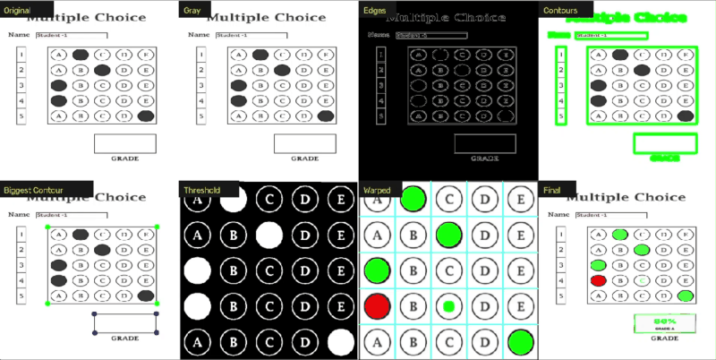

# Optical Mark Recognition (OMR) MCQ Automated Grading

<div align="center"> 
   
</div>

<div align="center">

[](https://www.python.org/)
[](https://opencv.org/)
[](https://numpy.org/)
[](tests/)
[](LICENSE)

</div>

An automated OMR system using OpenCV and Python to evaluate MCQ answer sheets in real time. Detects exam papers, corrects perspective distortion, segments answer bubbles, matches responses against an answer key, and projects graded results directly back onto the live feed.

<div align="center">
  
</div>

---

## Key Features

- **Real-Time Evaluation**: Graded responses and scores projected directly onto live webcam or video feeds.
- **8-Stage Diagnostic Pipeline**: Inspects intermediate stages: Original, Grayscale, Canny Edges, Contours, Sheet Boundary, Thresholding, Warped Grid, and Graded Output.
- **Perspective Correction**: Corrects rotational misalignment and optical distortion via 4-point perspective transformation.
- **Dynamic Answer Keys**: Supports flexible answer keys through command-line options (`--key "B,C,A,A,E"`) or configuration files.
- **Export Scans**: Saves timestamped, high-resolution annotated sheets to disk with a single keystroke (`S`).
- **Headless Benchmark Engine**: Runs automated evaluation across all benchmark sheets without opening GUI windows.

---

## Project Structure

```text
omr-automated-grader/
├── assets/                  # Media resources: benchmark sheets (1.jpg–5.jpg), template, demo video & GIF
├── Scanned/                 # Output directory for exported graded scan results
├── src/                     # Core application source code
│   ├── __init__.py          # Package initialization marker
│   ├── config.py            # Global configurations, dimensions, thresholds, paths & default answer key
│   ├── utils.py             # Computer vision utilities: contour detection, perspective warp & grid split
│   ├── grader.py            # Headless OMR engine (OMRGrader & OMRResult) with 8-stage diagnostic pipeline
│   └── app.py               # Interactive OpenCV GUI: video/webcam feed, HUD overlays & key controls
├── tests/                   # Automated pytest suite
│   ├── test_grader.py       # Benchmark evaluation (100%, 80%, 40%, 20%, 0%) & grading logic tests
│   └── test_main.py         # CLI argument parser, custom answer key & path validation tests
├── .gitignore               # Excludes virtual environments, caches, and IDE artifacts from Git
├── LICENSE                  # MIT open-source license
├── main.py                  # CLI entry point supporting webcam, video, image, and benchmark modes
├── pyproject.toml           # Project metadata, packaging configurations & pytest settings
├── requirements.txt         # Required Python runtime and development dependencies
└── README.md                # Project documentation, guides, and architecture overview
```

---

## File Descriptions

| File / Directory | Type | Description |
|:---|:---|:---|
| **`assets/`** | Directory | Media repository housing benchmark sheets (`1.jpg`–`5.jpg`), blank template (`MCQPaper.jpg`), continuous evaluation video (`demo_vid.mp4`), raw video capture (`omr_demo.mp4`), banner graphic, and animated demo GIF (`omr-demo.gif`). |
| **`Scanned/`** | Directory | Output directory where timestamped scans and annotated evaluation sheets are stored upon pressing `S`. |
| **`src/__init__.py`** | Source | Marks `src` as an importable Python package. |
| **`src/config.py`** | Source | Centralized configuration defining image processing dimensions (700×700), question grid geometry (5 questions × 5 choices), grade boundaries, directory paths, and default answer key (`[B, C, A, C, E]`). |
| **`src/utils.py`** | Source | Computer vision utility functions: corner reordering (`reorder`), 4-point contour approximation (`rect_contour`), bubble grid slicing (`split_boxes`), answer projection (`show_answers`), and multi-canvas tiling (`stack_images`). |
| **`src/grader.py`** | Source | Headless OMR grading engine (`OMRGrader` and `OMRResult`). Executes perspective transformation, inverse binary thresholding, non-zero pixel density counting, answer key matching, score calculation, and diagnostic stage extraction. |
| **`src/app.py`** | Source | Interactive desktop GUI application (`OMRApp`). Manages video and camera capture feeds, HUD overlays, notification toasts, keyboard navigation, and scan exports. |
| **`tests/test_grader.py`** | Test | Pytest suite validating end-to-end evaluation accuracy across benchmark answer sheets (80%, 100%, 40%, 20%, 0%), contour reordering invariants, and split box sizing. |
| **`tests/test_main.py`** | Test | Pytest suite verifying CLI argument parsing, letter-to-index answer key parsing, error handling on invalid tokens, headless benchmark execution, and asset path validity. |
| **`main.py`** | Entry Point | CLI entry point supporting interactive modes (`webcam`, `video`, `image`), custom video sources, user-defined answer keys, and headless benchmark testing. |
| **`requirements.txt`** | Config | Minimal list of external Python dependencies (`opencv-python`, `numpy`, `pytest`). |
| **`pyproject.toml`** | Config | Modern Python project configuration specifying project metadata, build configurations, and pytest tool options. |
| **`LICENSE`** | Legal | Full text of the MIT open-source license. |
| **`.gitignore`** | Config | Rules excluding virtual environments, bytecaches, IDE settings, and output scans from version control. |
| **`README.md`** | Documentation | Comprehensive project documentation, architectural diagrams, quick-start guide, and reference manuals. |

---

## Computer Vision Pipeline Stages

The evaluation process operates through an 8-stage image processing sequence:

1. **Original**: Captures raw feed from camera, video file, or static benchmark sheet.
2. **Grayscale**: Converts input to single-channel luminance for uniform gradient processing.
3. **Canny Edges**: Applies Gaussian blur and edge detection to trace structural outlines.
4. **Contours**: Detects all closed contours across the processed sheet.
5. **Biggest Contour**: Identifies the primary document boundary and isolates its 4 corner vertices.
6. **Threshold**: Performs perspective transformation and applies inverse binary thresholding to isolate filled bubbles.
7. **Warped**: Segments the bubble grid into 25 discrete cells and quantifies non-zero pixel density per choice.
8. **Final**: Evaluates detected choices against the answer key, colors selections (green for correct, red for incorrect), calculates percentage score, and projects the annotations back onto the final sheet.

---

## Keyboard Controls

| Key | Action |
|:---:|:---|
| **`V`** | Toggle Demo Video ↔ Live Webcam |
| **`M`** | Toggle Sample Images ↔ Video mode |
| **`N`** | Next benchmark sheet |
| **`P`** | Previous benchmark sheet |
| **`S`** | Save graded scan to `Scanned/` |
| **`Q`** / **`Esc`** | Quit application |

---

## Installation

### Prerequisites
- Python 3.10 or higher
- Webcam (optional, required only for live webcam grading)

```bash
# Clone the repository
git clone https://github.com/mohd-faizy/omr-automated-grader.git
cd omr-automated-grader

# Install dependencies
pip install -r requirements.txt
```

---

## Usage

```bash
# Default mode (runs continuous demo video)
python main.py

# Live webcam grading
python main.py webcam

# Static benchmark image evaluation
python main.py image

# Custom answer key (accepts letters or 0-indexed values)
python main.py --mode image --key "B,C,A,A,E"

# Custom video input source
python main.py --source "path/to/video.mp4"

# Headless benchmark test (no GUI window)
python main.py --benchmark
```

---

## Testing

Execute the test suite using pytest:

```bash
pytest -v
```

All 11 tests validate grading accuracy across all benchmark sheets (100%, 80%, 40%, 20%, 0%), answer key parsers, and system paths.

---

## License

This repository is licensed under the **MIT License**. See the [`LICENSE`](LICENSE) file for complete details.

---

## Connect with Me

<div align="center">

[](https://mohdfaizy.vercel.app)
[](https://www.linkedin.com/in/mohd-faizy/)
[](https://github.com/mohd-faizy)
[](https://www.credly.com/users/mohd-faizy)
[](https://twitter.com/F4izy)
[](https://ai.stackexchange.com/users/36737/faizy)

</div>